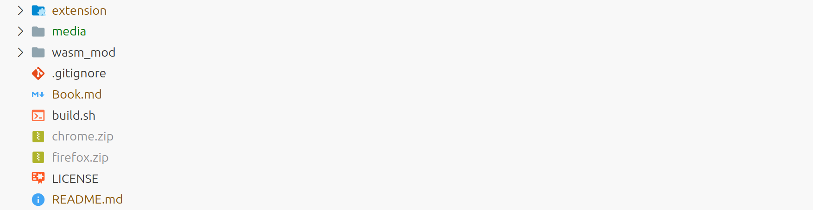
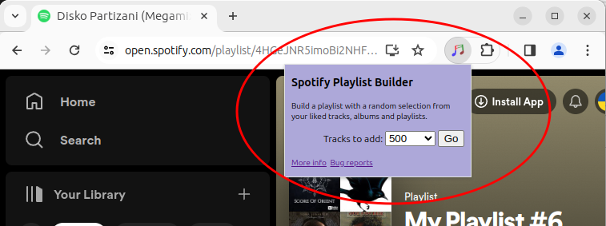
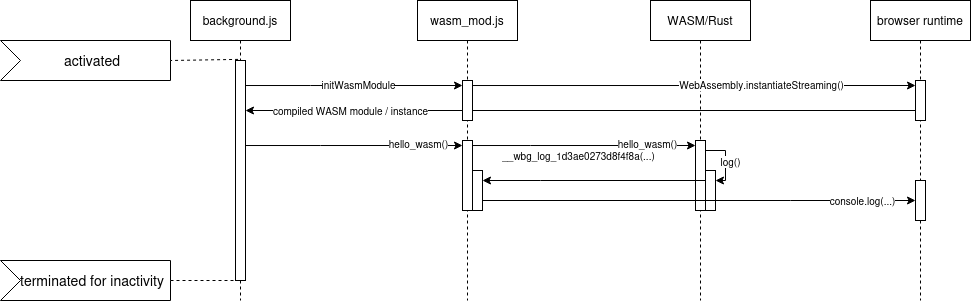
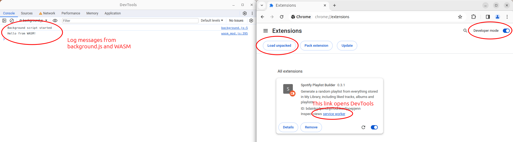
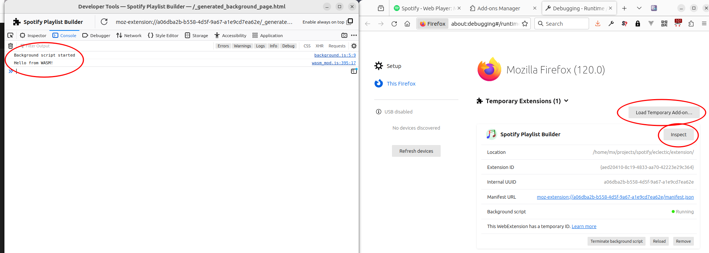
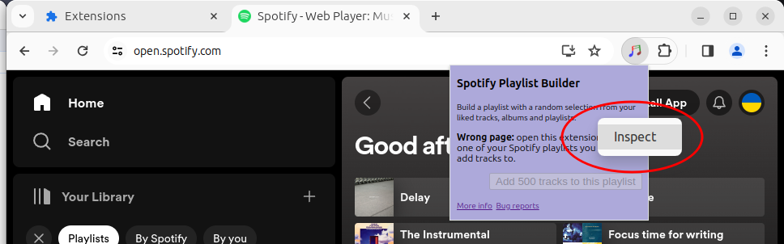
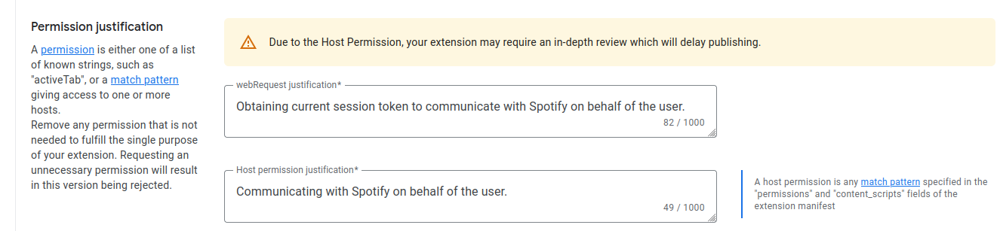

# How to build a cross-browser extension with Rust and WASM

This post explains the inner workings of a Chrome extension built with Rust and compiled into WASM.

**Target audience:** Rust programmers interested in building cross-browser extensions with WASM.

**About the extension:** [Github](https://github.com/rimutaka/spotify-playlist-builder), [Chrome Webstore](https://chromewebstore.google.com/detail/spotify-playlist-builder/kmbnbjbfpnchgmmkbeidpllpamcahljn), [Mozilla Webstore](https://addons.mozilla.org/en-US/firefox/addon/spotify-playlist-builder-addon/)

**What you will learn:**

* toolchain 
* architecture of the extension
* how WASM, background and content scripts communicate with each other
* intercepting session tokens to impersonate the user
* debugging
* making it work for Chrome and Firefox
* listing in Google and Mozilla addon stores

You will get the best value for your time if you [look at the source code](https://github.com/rimutaka/spotify-playlist-builder) and read this post side by side.

## Toolchain

The main tool to build, test and publish WASM: https://rustwasm.github.io/docs/wasm-pack/
```
cargo install wasm-pack
```
See [build.sh](./build.sh) for an example of [build command](https://rustwasm.github.io/docs/wasm-pack/commands/build.html).

_cargo_ installs [wasm-bindgen](https://rustwasm.github.io/wasm-bindgen/) on the first compilation to facilitate high-level interactions between wasm modules and JavaScript.

**References**:

* https://rustwasm.github.io/wasm-bindgen/ - Rust/WASM book with examples, explanations and details references. Read about:
  * Hello, World!
  * console.log
  * Without a bundler
* https://rustwasm.github.io/wasm-bindgen/api/web_sys/index.html - a Rust wrapper around [Web APIs](https://developer.mozilla.org/en-US/docs/Web/API). APIs of interest:
  * [Service Workers API](https://developer.mozilla.org/en-US/docs/Web/API/Service_Worker_API)
  * [Fetch API](https://developer.mozilla.org/en-US/docs/Web/API/Fetch_API)
* https://rustwasm.github.io/wasm-bindgen/api/js_sys/index.html - a Rust wrapper around JS types and objects


## Architecture of the extension

This extension consists of several logical modules:

* _manifest_ - the definition of the extension for the browser
* _background script_ - a collection of JS scripts and WASM code that run in a separate browser process regardless of the current web page
* _content script_ - the part of the extension that runs inside the current web page, but it is not used in this extension
* _popup_ - a window displayed by the browser when the user clicks on the extension button in the toolbar 

### Folders



* _extension_: the code of the extension as it is loaded into the browser, including JS and WASM
* _media_: various media files for publishing the extension, not essential
* _wasm_mod_: Rust code to be compiled into WASM 
* _wasm_mod/samples_: Spotify request/response captures, not essential


### Manifest V3

We have to use separate manifest V3 files for different browsers because of incompatible features:

* _extension/manifest_cr.json_: Chrome version
* _extension/manifest_ff.json_: Firefox version

Browser-specific manifests are renamed into _manifest.json_ by _build.sh_ as explained in _Debugging_ and _Packaging_ sections of this document.

List of manifest properties to pay attention to:

* _action/show_matches_ - when the browser should make the extension button active
* _action/default_popup_ - what should happen when the user clicks on the extension button
* _background/service_worker_ - the name of the script to run as a background service worker
* _content_security_policy_ - declares what the extension can do, e.g. load scripts or WASM

Other properties are either self-explanatory or not as important.

Manifest V3 docs: [MDN](https://developer.mozilla.org/en-US/docs/Mozilla/Add-ons/WebExtensions/manifest.json) / [Chrome](https://developer.chrome.com/docs/extensions/reference)

### Background script

[extension/js/background.js](extension/js/background.js) acts as a Service Worker. The name "background script" is historical and can be used interchangeably with "service worker".

What `background.js` does:

* loads and initializes WASM module
* listens to messages from WASM and the popup page ([extension/js/popup.html](extension/js/popup.html))
* sends error messages to the popup page ([extension/js/popup.js](extension/js/popup.js))
* captures session token (`captureSessionToken()`)
* fetches user details (`fetchUserDetails()`)
* extracts the current playlist ID from the active tab URL (`getPlaylistIdFromCurrentTabUrl()`)
* calls WASM functions in response to user actions (`add_random_tracks()`)
* controls the extension icon in the toolbar (`toggleToolbarBadge()`)

`background.js` is loaded when the browser is started and performs:
* WASM module initialisation
* adding listeners for messaging and token capture

Once running, `background.js` and its WASM part continue to run independently of the page it was started from. A service worker will continue running even if the user navigates elsewhere or closes the tab that started it because the [Service Worker lifecycle](https://developer.chrome.com/docs/extensions/develop/concepts/service-workers/lifecycle) is separate from that of the document.

More on service workers: [MDN](https://developer.mozilla.org/en-US/docs/Web/API/Web_Workers_API/Using_web_workers) / [Chrome](https://developer.chrome.com/docs/extensions/develop/concepts/service-workers)

### Popup page

The manifest file instructs the browser to open a popup window when the extension is activated by the user, e.g. with a click on the extension icon in the toolbar.



This line of the manifest defines what popup window to open when the user clicks on the toolbar button:

```
"default_popup": "js/popup.html"
```

The popup lives only while it is being displayed. It cannot host any long-running processes and it does not retain the state from one activation to the other. All `DOMContentLoaded` events fire every time it is activated.

What `popup.js` does:

* attaches event handlers to its buttons and links
* handles _on-click_ for links because browsers do not open link URLs from popups (see `chrome.tabs.create()`)
* listens to messages from `background.js` and WASM (see `chrome.runtime.onMessage.addListener()`)
* displays an activity log from the messages it receives from WASM and _background.js_

Any inline JS in _popup.html_ is ignored. Any JS code or event handlers have to be loaded externally with `<script type="module" src="popup.js">` because only _src_ scripts are allowed by `content_security_policy/extension_pages` entry of the manifest.

### Content script

Content scripts interact with the UI and DOM. They run in the same context as the page and have access to [Window](https://developer.mozilla.org/en-US/docs/Web/API/Window) object as their main browser context.

This extension does not interact with the Spotify tab and does not need a content script.

## Messaging between the scripts

Communication between different scripts (background, popup, WASM) is done via asynchronous message passing. A script A sends a message to a shared pool hoping that the intended recipient is listening and can understand the message. This means that if there are multiple listeners, all of them get the message notification. The sender does not get notifications for the messages it sends out.

It is possible to invoke functions from a different script within the same extension, but the script will run in the context of the caller. For example, `popup.js` can call a `background.js` function when the user clicks on a button inside the popup. The invocation will work in the context of the popup and die as soon as the popup is closed.

On the other hand, `background.js` is a long-running process. It listens to messages sent to it from other scripts. E.g. `chrome.runtime.onMessage.addListener()` function checks the message payload and acts depending on the message contents.

This extension relies on messaging, not direct invocation.

Key messaging concepts:

* messages are objects
* the only metadata attached to the message is the sender's details
* structure the message to include any additional metadata, e.g. the type of the payload
* always catch `chrome.runtime.sendMessage()` errors because there is no guarantee of delivery and an unhandled error will fail your entire script
* an error is always raised if you send a message and there is no active listener, e.g. if you expect a popup to listen, but the user closed it
* message senders cannot receive their own messages, so if you send and listen within the same script, there will be no message notification to self, only to other listeners

More on message passing between different scripts: https://developer.chrome.com/docs/extensions/develop/concepts/messaging.

### Messaging examples

#### From background.js to popup.js

`background.js` sends error messages out to anyone who listens. It handles non-delivery errors by ignoring them.

`popup.js` listens and displays them if `popup.html` is open. If the popup is not open, there is no listener and the sender gets an error. These errors should be handled for the rest of the sender's script to work.

```
chrome.runtime.sendMessage("Already running. Restart the browser if stuck on this message.").then(onSuccess, onError);
```
where both `onSuccess` and `onError` do nothing to prevent the error from bubbling up to the top.

#### From popup.js to background.js

`popup.js` sends a message out when the user clicks _Add tracks_ button.

`background.js` listens and invokes WASM to handle the user request.

The popup script could call a function in the background script to invoke WASM or even call WASM directly, but the popup lives only if open. Also, it wouldn't have access to the token stored in the context of the long-running `background.js` process.

So, we have a long-running background script that lives independently of the tabs or the popup. When a message from the popup arrives, _background.js_ calls WASM and continues running even if the caller no longer exists.

#### Sending messages from WASM to JS scripts

WASM sends out messages via `report_progress()` function located in `wasm_mod/src/progress.js` script. That function is imported into `wasm_mod/src/lib.rs` as

```
#[wasm_bindgen(module = "/src/progress.js")]
extern "C" {
    pub fn report_progress(msg: &str);
}
```
and is called from other Rust functions as a native Rust function.

The progress reporting from WASM to the popup delivers messages in near-real-time while the WASM process continues running.

## WASM

_wasm_mod_ folder contains the WASM part of the extension.

### Inside Cargo.toml

Cargo file: [wasm_mod/Cargo.toml](wasm_mod/Cargo.toml)

`crate-type = ["cdylib", "rlib"]`

* _cdylib_: used to create a dynamic system library, e.g. .so or .dll, but for WebAssembly target it creates a *.wasm file without a start function
* _rlib_: optional, used to create an intermediate "Rust library" for unit testing with `wasm-pack test`

More on targets: https://doc.rust-lang.org/reference/linkage.html

### Dependencies

* _wasm-bindgen_: contains the runtime support for `#[wasm_bindgen]` attribute, _JsValue_ interface and other JS bindings ([crate docs](https://rustwasm.github.io/wasm-bindgen/api/wasm_bindgen/index.html))
* _js-sys_: bindings to JS types, e.g. Array, Date and Promise ([crate docs](https://rustwasm.github.io/wasm-bindgen/api/js_sys/index.html))
* _web-sys_: raw API bindings for Web APIs, 1:1, e.g. the browser Window object is web_sys::Window with all the methods, properties and events available from JS ([crate docs](https://rustwasm.github.io/wasm-bindgen/api/web_sys/index.html))

Remember to add WebAPI classes and interfaces as _web-sys_ features in your Cargo.toml. E.g. if you want to use _Window_ class in Rust code it has to be added to _web-sys_ features first.

More about how Rust binds to browser and JS APIs: https://rustwasm.github.io/wasm-pack/book/tutorials/npm-browser-packages/template-deep-dive/cargo-toml.html

### Calling WASM from JS example

_background.js_ makes a call to `hello_wasm()` from _lib.rs_ that logs a greeting in the browser console for demo purposes.

#### `hello_wasm()` sequence diagram



#### How `console.log()` is called from Rust

To log something into the browser console our Rust code has to access the logging function of WebAPI provided by the browser.
_lib.rs_ imports WebAPI `console.log()` function and makes it available in Rust:

```
#[wasm_bindgen]
extern "C" {
    #[wasm_bindgen(js_namespace=console)]
    fn log(s: &str);
}
```

The low-level binding is done by _web-sys_ and _js-sys_ crates with the help of _wasm-bindgen_ and _wasm-pack_.

#### How Rust's `hello_wasm()` is called from JS

To call a Rust/WASM function from JS we need to export it with `#[wasm_bindgen]`.

_lib.rs_ exports `hello_wasm()` Rust function and makes it available to `background.js`:

```
#[wasm_bindgen]
pub fn hello_wasm() {
    log("Hello from WASM!");
}
```

_wasm-bindgen_ and _wasm-pack_ generate _wasm_mod.js_ file every time we run the build. That file is the glue between WASM and JS. Some of its high-level features:

* initializes the WASM module
* exports `wasm.hello_wasm()` function for _background.js_
* type and param checking

#### How WASM is initialized

Every time the browser activates the extension, it runs the following code from _background.js_:

```
import initWasmModule, { hello_wasm } from './wasm/wasm_mod.js';
(async () => {
    await initWasmModule();
    hello_wasm(); 
})();
```

_wasm-bindgen_ and _wasm-pack_ generate the initialization routine and place it in _wasm_mod.js_ file as the default export. 


### lib.rs

_lib.rs_ is the top-level file for our WASM module. It exposes Rust functions and binds to JS interfaces.

#### Main entry point

The main entry point that does the work of adding tracks to the current playlist is `pub async fn add_random_tracks(...)`.

#### Browser context

The code will need access to some global functions that are only available through an instance of a browser context or runtime. The two main classes that serve this purpose are `WorkerGlobalScope` and `Window`.

The important difference between the two is that: 

* `WorkerGlobalScope` is available to Service Workers (background scripts running in their own process independent of a web page)
* `Window` is available to content scripts running in the same process as the web page

Both classes are very similar, but have slightly different sets of properties and methods.

_lib.rs_ obtains a reference to the right browser runtime inside `async fn get_runtime()` and passes it to other functions.

`get_runtime()` attempts to get a reference to `WorkerGlobalScope` first. If that fails it tries to get a reference to `Window` object. One works in Chrome and the other in Firefox.

#### Reporting progress back to the UI

Our WASM code may take minutes to run. It reports its progress and failures back to the UI via browser messaging API.

`pub fn report_progress(msg: &str)` in _lib.rs_ is a proxy for `report_progress()` in _progress.js_.
It is called from various locations in our Rust code to send progress and error messages to `popup.js`.

To make a custom JS function available to Rust code we created _wasm_mod/src/progress.js_ with the following export:

```
export function report_progress(msg) {
  chrome.runtime.sendMessage(msg).then(handleResponse, handleError);
}
```

and matched it by creating this import in _lib.rs_:
```
#[wasm_bindgen(module = "/src/progress.js")]
extern "C" {
    pub fn report_progress(msg: &str);
}
```
_wasm-bindgen_ and _wasm-pack_ generate necessary bindings and copy _progress.js_ to _extension/js/wasm/snippets/wasm_mod-bc4ca452742d1bb1/src/progress.js_.


### other .rs files

The rest of .rs files contain vanilla Rust that can be compiled into WASM.

* _client.rs_ - a single high-level function that brings everything together
* _api_wrappers.rs_ - a collection of wrappers for Spotify API, called from client.rs
* _constants.rs_ - shared constants, utility functions
* _models.rs_ - Rust structures for Spotify requests and responses

## Token capture

The extension needs some kind of credentials to communicate with Spotify on behalf of the user. One way of achieving this without asking the user is to capture the current session token. For that to work, the user has to navigate to a Spotify web page and log in there.

A frequent Spotify user would already be logged in, because Spotify maintains an active session on all *.spotify.com pages.

This extension captures all request headers sent to `https://api-partner.spotify.com/pathfinder/v1/query` endpoint, including the tokens. The headers are stored in local variables and are copied into requests made by the extension to mimic the Spotify app.


`captureSessionToken()` function from _background.js_ does the header extraction when _onBeforeSendHeaders_ event is triggered:

```
chrome.webRequest.onBeforeSednHeaders.addListener(captureSessionToken, { urls: ['https://api-partner.spotify.com/pathfinder/v1/query*'] }, ["requestHeaders"])
```

* _onBeforeSendHeaders_ listener reads, but does not modify the headers on `https://api-partner.spotify.com/pathfinder/v1/query*`.
* The `*` at the end of the URL is necessary for the pattern to work.
* `["requestHeaders"]` param instructs the browser to include all the headers in the request details object passed onto _captureSessionToken_ handler. Only the URL and a few common headers are included If that param is omitted.
* `host_permissions": ["*://*.spotify.com/*"]` in _manifest.json_ is required for _onBeforeSendHeaders_ to work.

All extracted headers are stored in `headers` variable inside _background.js_. The tokens are stored in `auth` and `token` vars. None of the headers or tokens are persisted in storage.

The tokens are passed onto WASM as function parameters:
```
#[wasm_bindgen]
pub async fn add_random_tracks(
    auth_header_value: &str,
    token_header_value: &str,
    playlist_id: &str,
    user_uri: &str,
)
```

## Debugging

Extensions can be loaded from source code in Firefox and Chrome for testing and debugging.

### Firefox

1. run `. build.sh` to build the WASM code
2. go to _about:debugging#/runtime/this-firefox_
3. click on _Load temporary Add-on_ button
4. Firefox opens a file selector popup asking to select _manifest.json_ file. Remember to rename _manifest_ff.json_ into _manifest.json_.

If the extension was loaded correctly, its details should appear inside the _Temporary Extensions_ section on the same page.

If you keep losing this obscure _about:debugging#/runtime/this-firefox_ URL, there is an alternative way of getting to the debugging page in Firefox:

* click on _extensions_ icon in the toolbar
* click on _Manage extensions_
* click on _settings_ gear-like icon at the top right of the page
* click on _Debug Add-ons_

### Chrome

The Chrome process is very similar to the one in Firefox.

1. run `. build.sh` to build the WASM code
2. go to _chrome://extensions/_
3. Turn on _Developer mode_ toggle at the top-right corner of the page
4. Cick on _Load unpacked_ and select the folder with _manifest.json_. Remember to rename _manifest_cr.json_ into _manifest.json_.

If the extension was loaded correctly, its details should appear in the list of extensions on the same page. See [Chrome docs](https://developer.chrome.com/docs/extensions/get-started/tutorial/hello-world#load-unpacked) for more info.

If you forget what the direct URL is (_chrome://extensions/_), there is an alternative way of getting to the debugging page in Chrome:

* click on `...` icon in the Chrome toolbar to open the Chrome options menu
* click on _Extensions / Manage Extensions_
* Chrome will open chrome://extensions/ page

### Making changes and reloading

Changes to code located inside _wasm_mod/src_ folder require running _build.sh_ script to rebuild the WASM code. 

Changes to JS, CSS or asset files inside _extension_ folder do not require a new build and are picked up by the browser when you reload the extension.

Click on _Reload_ icon for the extension to load the latest changes.

For example, changing _lib.rs_ or _progress.js_ requires a rebuild and reload. Changing _popup.js_ only requires a reload.

### Viewing logs

Different modules log messages into different consoles. If you are not seeing your log message, you are probably looking at the wrong console.

Content scripts output log messages (e.g. via `console.log()`) to the same log as the web page. View them in _DevTools / Console_ tab for the web page.

Background scripts, including WASM, send messages to a separate console log. 

* _in Chrome_: click on _Inspect views_ link in the extension details panel (e.g. _Inspect views service worker (Inactive)_)
  


* _in Firefox_: click on _Inspect_ button in the extension details panel



If you follow the steps above, Firefox should open a new DevTools window with Console, Network and other tabs.

Popup windows (e.g. _popup.html_) in Firefox log messages into the same console as the background scripts. 

The popup window in Chrome also logs into the same console as the background script, but you have to enable it with a separate step.

Right-click on the open popup and select _Inspect_. It will open a new DevTools window with both background and popup logs. Closing the popup window kills the DevTools window as well.



Network requests and responses from _background.js_ and WASM appear in the background DevTools window.

## Cross-browser compatibility

Most of the extension code works in both, Firefox and Chrome. There are a few small differences that have to be kept separate: _manifest_, _global context_ and _host_permissions_.

### manifest.json

`background.js` lives under different manifest property names:
* Firefox: _background/scripts_
* Chrome: _background/service_worker_

Firefox complains about `minimum_chrome_version`, `offline_enabled` and `show_matches`.

Chrome rejects `browser_specific_settings` required by Firefox.

See the full list of manifest differences between Firefox and Chrome with this CLI command:
```
git diff --no-index --word-diff extension/manifest_cr.json extension/manifest_ff.json
```

This project is configured to have two manifests in separate files: _manifest_cr.json_ and _manifest_ff.json_. Rename one of them manually into _manifest.json_ for local debugging and then revert to the browser-specific file when finished. _build.sh_ script renames them to _manifest.json_ on the fly during packaging.

If a package has no _manifest.json_ it is not recognized as an extension by the browser.

### Global context

Firefox and Chrome use different global context class names to access methods such as `fetch()`:
* `WorkerGlobalScope`
* `Window`

Both classes are part of the standardized WebAPI. The difference is in how they are used in content and background scripts.

__Chrome__

* `web_sys::window()` function returns _Some(Window)_ for content scripts and _None_ for Service Workers
* `js_sys::global().dyn_into::<WorkerGlobalScope>()` returns _Ok(WorkerGlobalScope)_ for Service Workers and _Err_ for content scripts

__Firefox__

* `web_sys::window()` function returns _Some(Window)_ for both, context and Service Worker scripts
* `js_sys::global().dyn_into::<WorkerGlobalScope>()` always returns _None_

It looks like Firefox is not compliant with the standard or even MDN, but maybe I missed something and got this part wrong.

See `get_runtime()` function in [lib.rs](wasm_mod/src/lib.rs) for more implementation details. Also, see [Window](https://developer.mozilla.org/en-US/docs/Web/API/Window) and [WorkerGlobalScope](https://developer.mozilla.org/en-US/docs/Web/API/WorkerGlobalScope) docs on MDN.

### Host permissions

Both Chrome and Firefox have this entry in the manifest:
```json
"host_permissions": [
    "*://*.spotify.com/*"
]
```

The format is the same, but Chrome grants this permission on install and Firefox treats it as an optional permission that has to be requested at runtime.

The extension code handles this discrepancy gracefully at the cost of some complexity. More info:

* the implementation of `btn_add` _click_ listener in [popup.js](extension/js/popup.js) has detailed comments
* MDN docs: https://developer.mozilla.org/en-US/docs/Mozilla/Add-ons/WebExtensions/API/permissions/request
* Firefox's strange behavior: https://stackoverflow.com/questions/47723297/firefox-extension-api-permissions-request-may-only-be-called-from-a-user-input


## Listing WASM extensions in Google and Mozilla addon stores

There are no special listing requirements for extensions containing WASM code.

Both Google and Mozilla may request the source code and build instructions for the WASM part, which may delay the review process. This extension is 100% open source and was always approved within 24hrs.

### Packaging

_build.sh_ script packages the extension into _chrome.zip_ and _firefox.zip_ files. The packaging steps include:

* building the WASM code with _wasm-pack_
* removing unnecessary files
* renaming browser-specific manifest files to _manifest.json_
* zipping up _extension_ folder into _chrome.zip_ and _firefox.zip_ with the right manifest

_wasm-pack_ copies .js files from _wasm_mod/src_ folder to _extension/js/wasm/snippets/wasm_mod/src_  if they are used for binding to Rust. E.g. _wasm_mod/src/progress.js_ is copied to _extension/js/wasm/snippets/wasm_mod-bc4ca452742d1bb1/src/progress.js_.

See detailed packaging instructions for [Firefox](https://extensionworkshop.com/documentation/publish/package-your-extension/) and [Chrome](https://developer.chrome.com/docs/extensions/how-to/distribute) for more info.

### Listing

The listing form has no WASM-specific questions or options. Make sure you do not have any unused permissions in the manifest and give clear explanations why you need the permissions you request.



#### Useful links

_Firefox_

* Example: https://addons.mozilla.org/en-US/firefox/addon/spotify-playlist-builder-addon/
* Sign up here: https://addons.mozilla.org/en-US/developers/
* List your extensions: https://addons.mozilla.org/en-US/developers/addons
* Uploading listing images may only be available after the extension is approved.

_Chrome_

* Example: https://chromewebstore.google.com/detail/spotify-playlist-builder/kmbnbjbfpnchgmmkbeidpllpamcahljn
* Sign up and list your extensions: https://chrome.google.com/webstore/devconsole

#### Listing process

* Sign up, create a new listing, describe the extension and upload the _.zip_ for review
* Check any errors and warnings generated by the store website after uploading the _.zip_
* Approval time for both stores is about 24 hours, from personal experience.
* Any change in the code or the listing requires a store review before it is published

Both stores allow listing extensions without them appearing in the public directory while users with the extension URL can still access it.


