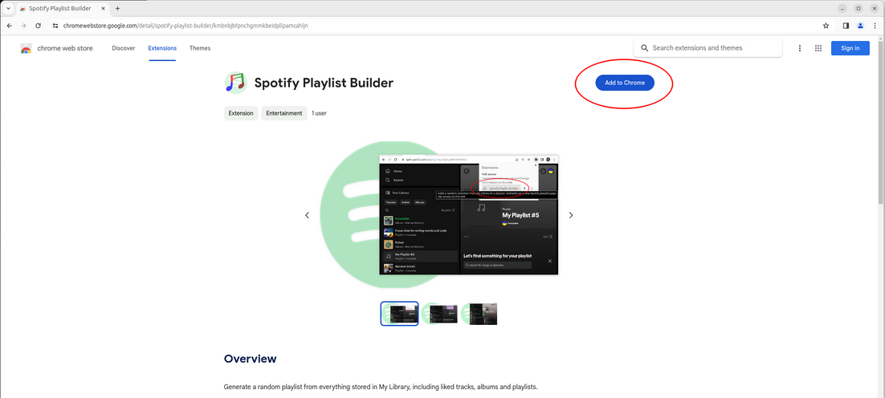
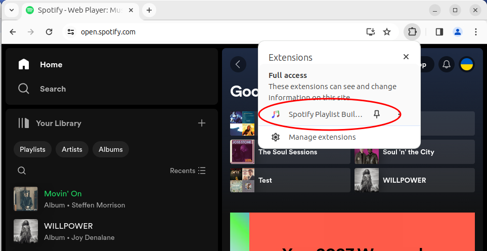
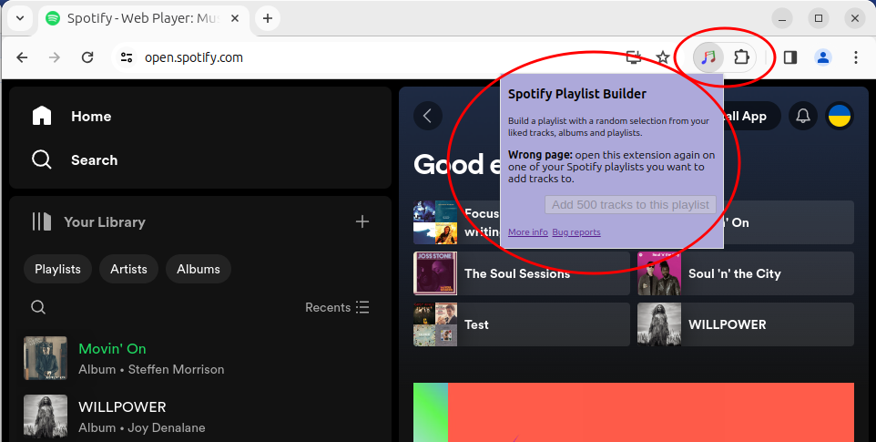
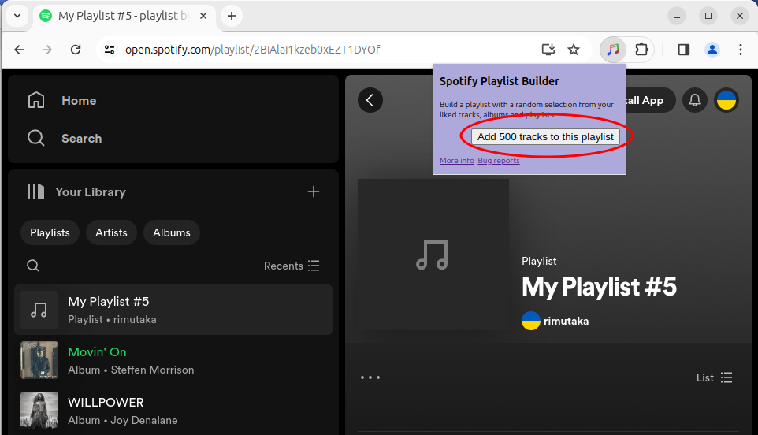
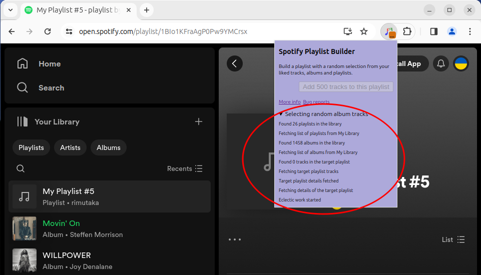
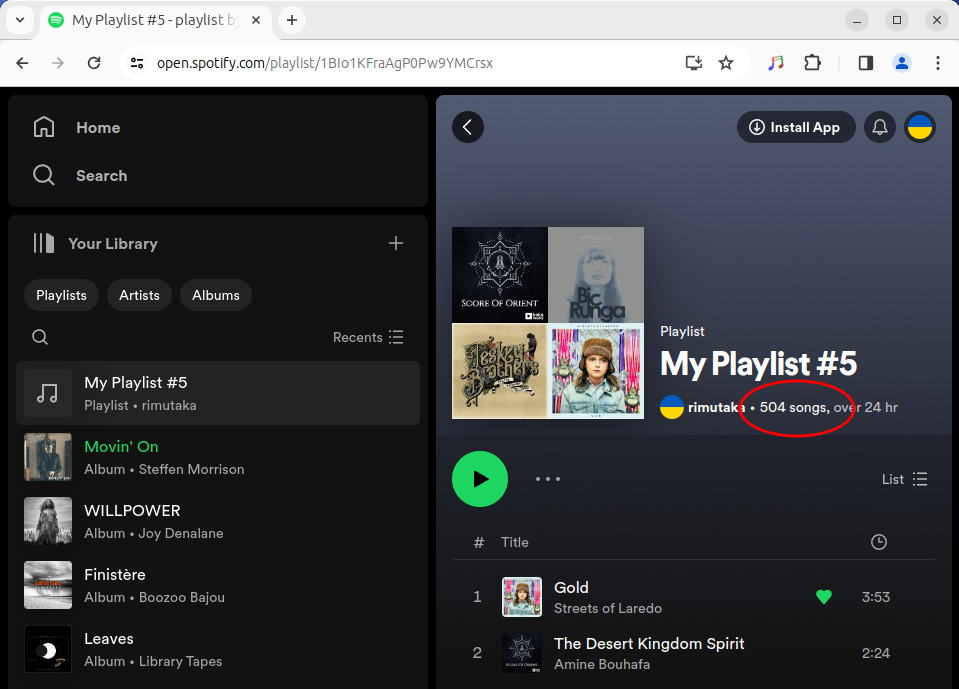

# Chrome extension for generating random playlists from your library tracks, albums and playlists 

This extension builds a Spotify playlist out of a random selection of tracks found in _My Library_ to let you listen to everything you have in there on shuffle.  

It picks tracks from Liked Songs, Liked Albums and Liked Playlists.

**Extension developers:** see [Book.md](./Book.md) for a deep dive into Rust/WASM in browser extensions.

### Get started

* Install the extension ([Chrome Webstore](https://chromewebstore.google.com/detail/spotify-playlist-builder/kmbnbjbfpnchgmmkbeidpllpamcahljn) / [Firefox Addons](https://addons.mozilla.org/en-US/firefox/addon/spotify-playlist-builder-addon/))
* Log into Spotify
* Create a new playlist
* Click on the extension button in the toolbar menu to add tracks

### Screenshots

Install the extension from [Chrome Webstore](https://chromewebstore.google.com/detail/spotify-playlist-builder/kmbnbjbfpnchgmmkbeidpllpamcahljn). Firefox users, install from [Mozilla Webstore](https://addons.mozilla.org/en-US/firefox/addon/spotify-playlist-builder-addon/).

Activate the extension

The extension works only on a page with a Spotify playlist. Opening it on any other page disables the _Go_ button.

Create a new playlist or open a playlist you created earlier.
New tracks are added at the end of the playlist if it already has some tracks in it.

A simple progress log is displayed while the tracks are being added.
Keep the popup window open if you want to watch the updates.

The little badge with `...` over the toolbar button appears while the background script is running. The extension will continue running if you navigate away from the playlist page or close the window.

Refresh the page to see newly added tracks.

### Feedback and bug reports

Feel free to [open an issue](https://github.com/rimutaka/spotify-playlist-builder/issues) if you run into problems or have any feedback.

### Privacy policy

This extension does not collect any information about the user or user activities.  
The only site it communicates with is Spotify.

## Under the hood

The plugin intercepts the session token from Spotify requests and impersonates the Spotify client to:
* read the contents of the user library
* add random tracks from your library to the current playlist

It does not transmit any of your data to any third party. All requests go to Spotify only.

Most of the work is done by [a WASM module](wasm_mod) built in Rust.

[Book.md](./Book.md) explains the inner workings of this extension to help you create your first browser extension with Rust/WASM.

## Attributions

The extension stub was taken from https://github.com/theberrigan/rust-wasm-chrome-ext by https://github.com/theberrigan.

The toolbar icon is based on a vector image by https://rawpixel.com.